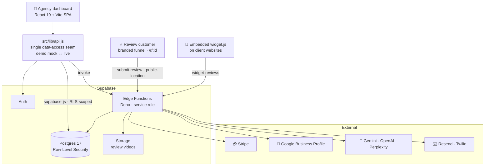
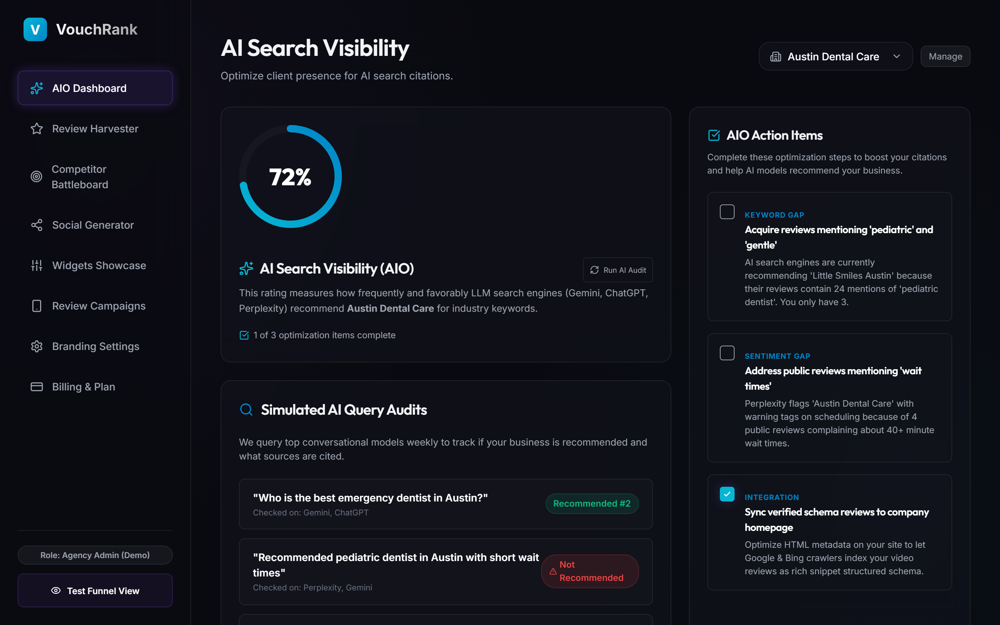
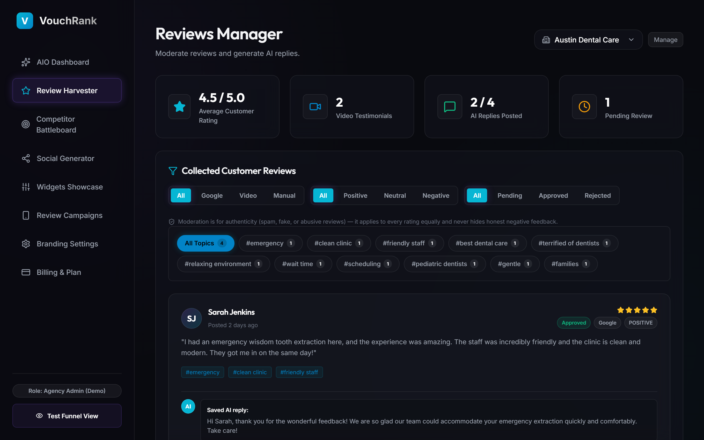
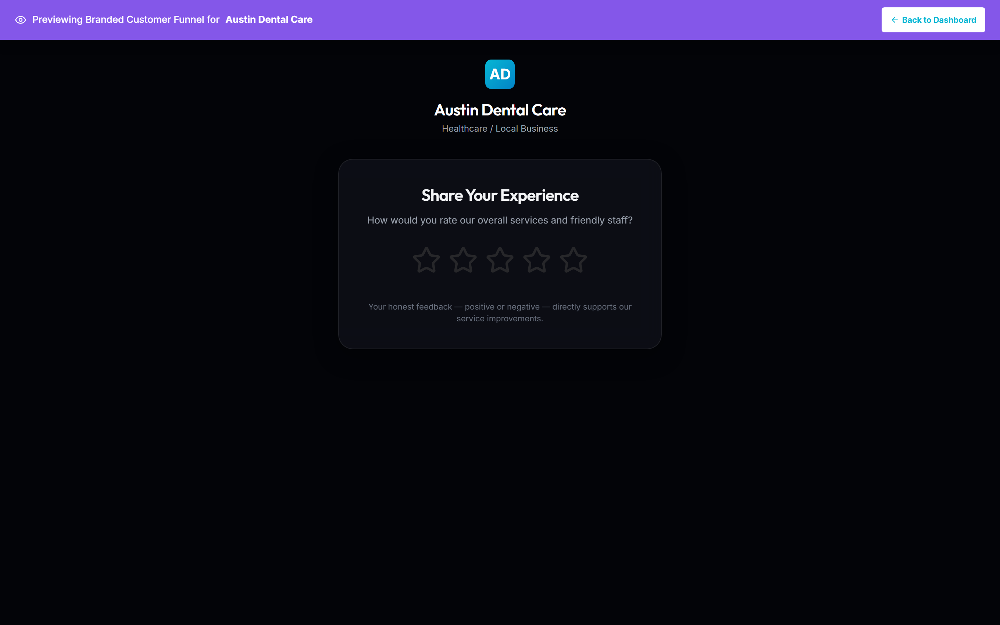

# VouchRank

> **▶ Live demo: [vouchrank.vercel.app](https://vouchrank.vercel.app)** · fully clickable on mock data, no signup required.

**A multi-tenant, white-label reputation platform that helps local businesses get
recommended by AI search engines; built compliant with 2026 review regulations.**

Marketing agencies use VouchRank to collect reviews (Google, video, and text)
through a branded funnel, measure how often ChatGPT / Gemini / Perplexity recommend
their clients, turn praise into social content, and embed social-proof widgets; all
under their own brand.

> **Why now:** consumers increasingly ask AI assistants for local recommendations,
> and in 2026 the FTC and Google began actively penalizing "review gating." Most
> legacy reputation tools were built around gating. VouchRank is built the
> opposite way (compliant by design) which is both the legal-safe and the
> trustworthy choice. See [COMPLIANCE.md](COMPLIANCE.md).

---

## Features

- **🤖 AI-Search (AIO/GEO) audit**: scores how often a business is recommended by
  LLMs for local-intent queries, with an optimization checklist.
- **🎥 Compliant review funnel**: every customer gets the same options (Google /
  video / text review + private feedback); in-browser video capture; consent built in.
- **🎨 Review → social graphics** — one-click branded PNGs from canvas.
- **🔗 Embeddable widgets** — carousel + grid social-proof widgets with themes.
- **📣 Review-request campaigns** — SMS (Twilio) + email (Resend), compliant copy.
- **🏷️ White-label multi-tenancy** — per-agency branding and sub-accounts (custom-domain routing planned, see [ROADMAP.md](ROADMAP.md)).
- **💳 Billing**: Stripe subscriptions ($299 Agency / $499 Agency Pro).

## Tech stack

| Layer | Tech |
|---|---|
| Frontend | React 19, Vite 8, lucide-react, plain CSS |
| Backend | Supabase: Postgres 17 (Row-Level Security), Auth, Storage, Edge Functions (Deno/TS) |
| Billing | Stripe: Checkout + billing portal |
| Integrations | Google Business Profile API · Gemini / OpenAI / Perplexity · Resend · Twilio |
| Hosting & tooling | Vercel · Playwright (e2e) · ESLint |

## Quickstart

```bash
npm install
npm run dev        # http://localhost:5173
```

**Demo mode (default):** with no environment variables, the app runs entirely on
mock data; auth is bypassed and every backend action is simulated, so you can click
through the whole product immediately.

**Live mode:** copy `.env.example` to `.env` and set `VITE_SUPABASE_URL` +
`VITE_SUPABASE_PUBLISHABLE_KEY`. Auth turns on and the app reads/writes a real
multi-tenant Postgres backend. A project is already provisioned (see
[BACKEND.md](BACKEND.md)).

```bash
npm run build      # production build
npm run lint       # ESLint (0 errors)
```

## Architecture



Components never talk to the database directly; they go through a single seam,
`src/lib/api.js`, which serves mock data in demo mode and RLS-scoped Postgres +
Edge Functions in live mode. Each agency is an isolated tenant enforced by Postgres
Row-Level Security. The public review funnel posts to a server-side Edge Function
rather than writing to the DB directly. Full detail in
[ARCHITECTURE.md](ARCHITECTURE.md).

## Documentation

- [ARCHITECTURE.md](ARCHITECTURE.md) — system design, data model, RLS, edge functions
- [COMPLIANCE.md](COMPLIANCE.md) — the review-gating rules (read before touching the funnel)
- [BACKEND.md](BACKEND.md) — deploy runbook (Supabase, Stripe, Google, Twilio)
- [ROADMAP.md](ROADMAP.md) — what's done and what's next
- [LICENSE.md](LICENSE.md) — PolyForm Noncommercial License 1.0.0
- [AGENTS.md](AGENTS.md) / [CLAUDE.md](CLAUDE.md); context for AI coding agents

## Status

A polished, **fully-clickable demo is live at [vouchrank.vercel.app](https://vouchrank.vercel.app)**
(demo mode; mock data, auth bypassed, every action simulated).

Phase 0 (foundation) is complete and **Phase 1 (integrations) is live**: 12 Supabase Edge
Functions deployed, Stripe Checkout + billing portal (test mode), Gemini-powered AI audits,
and Google OAuth wired (Google review *sync* pending GBP API-access approval). **Phase 2
(private beta)** work has shipped: location-management CRUD, the embeddable `widget.js`,
review moderation, error/empty states, and full mobile responsiveness. See [ROADMAP.md](ROADMAP.md).

## Screenshots

**AIO dashboard**; AI-visibility score, simulated multi-engine query audits, and an optimization checklist:



| Review moderation (approve / reject / AI replies) | Compliant branded funnel |
|---|---|
|  |  |

## License

Licensed under the [PolyForm Noncommercial License 1.0.0](LICENSE.md) — free for
noncommercial use; commercial use requires a separate license.
